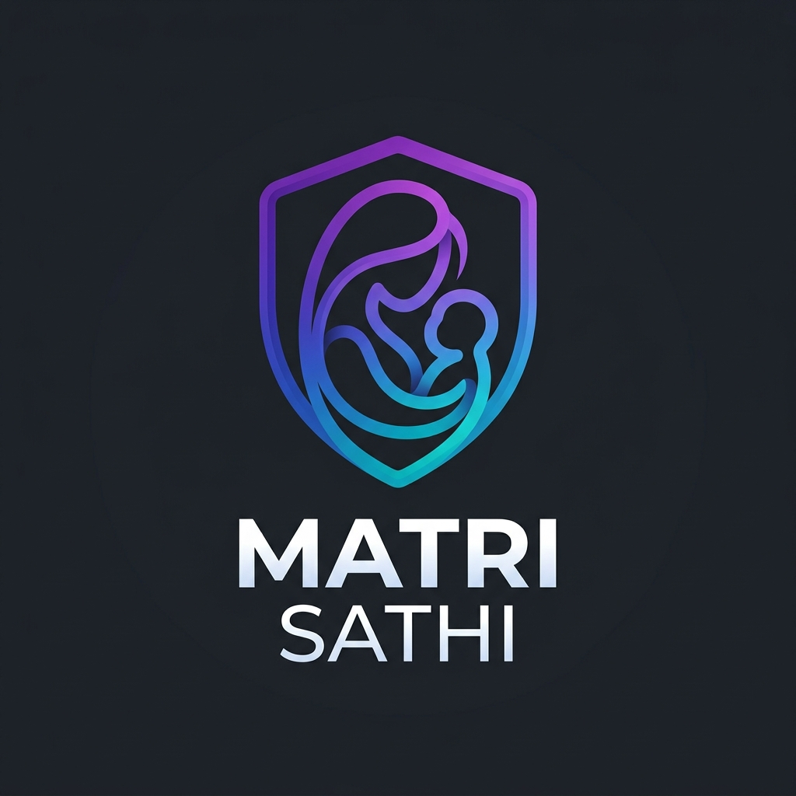

<div align="center">



# 🍼 Matri Sathi
### *AI-Powered Infant Guardian System*

[](https://python.org)
[](https://fastapi.tiangolo.com)
[](https://ultralytics.com)
[](https://opencv.org)
[](https://developer.mozilla.org/en-US/docs/Web/API/WebSocket)
[](LICENSE)

> **Guardian Eyes, Always Awake.**  
> Matri Sathi is an intelligent, real-time infant monitoring system that uses state-of-the-art AI models to detect sleep positions and activity levels — delivering instant alerts to parents before danger strikes.

---

[🚀 Quick Start](#-quick-start) · [🧠 AI Models](#-ai-model-architecture) · [🏗️ Architecture](#️-system-architecture) · [📡 API Reference](#-api-reference) · [👥 Team](#-team)

</div>

---

## 📖 Table of Contents

1. [Overview](#-overview)
2. [Key Features](#-key-features)
3. [AI Model Architecture](#-ai-model-architecture)
   - [Model 1 — Infant Sleep Position Classifier](#model-1--infant-sleep-position-classifier)
   - [Model 2 — Activity Surveillance (YOLOv8s)](#model-2--activity-surveillance-yolov8s)
4. [System Architecture](#️-system-architecture)
5. [Tech Stack](#-tech-stack)
6. [Quick Start](#-quick-start)
7. [Project Structure](#-project-structure)
8. [API Reference](#-api-reference)
9. [WebSocket Protocol](#-websocket-protocol)
10. [Configuration](#️-configuration)
11. [Team](#-team)

---

## 🌟 Overview

Matri Sathi was built around a single principle: **parents deserve eyes that never blink.**

Traditional baby monitors are passive — they show you a feed but leave all analysis to the exhausted parent. Matri Sathi is an **active AI guardian** that:

- 🔍 **Classifies** the infant's sleep position every 10 seconds using a custom-trained YOLO model
- 🏃 **Tracks** movement and inactivity in real-time using YOLOv8 object tracking
- 📡 **Streams** live annotated video at ~20 FPS via MJPEG to any browser
- ⚡ **Alerts** instantly via WebSocket when a dangerous position or inactivity is detected
- 🌐 **Serves** a modern, dark-mode web dashboard with real-time AI confidence scores

The entire system runs **locally** on a single machine — no cloud, no latency, no privacy concerns.

---

## ✨ Key Features

| Feature | Description |
|---------|-------------|
| 🛌 **Sleep Position Detection** | Custom YOLOv8 model classifies `Back (Safe)` vs `Prone (Danger)` every 10 seconds |
| 🎥 **Live MJPEG Stream** | Real camera feed annotated with bounding boxes, status overlays, and AI labels at ~20 FPS |
| 📊 **Real-time WebSocket** | Full AI state (position, confidence, motion score, logs) pushed to all browser clients instantly |
| ⚠️ **Instant Alerts** | Visual banner + toast alerts for prone position and sustained inactivity |
| 📈 **Model Confidence Circles** | Live circular progress indicators showing actual model output confidence values |
| 🏃 **Motion Analysis** | 10-frame rolling-average pixel-diff motion scoring with Active / Low / Inactive state machine |
| 🌙 **Dark / Light Mode** | Premium glassmorphism UI with full dark/light theme toggle |
| 📱 **Responsive** | Mobile bottom-nav + desktop nav bar — works on phones, tablets, and desktops |

---

## 🧠 AI Model Architecture

Matri Sathi runs **two parallel AI models** simultaneously on the live camera feed, each optimized for a different task.

---

### Model 1 — Infant Sleep Position Classifier

```
┌─────────────────────────────────────────────────────────────────────────┐
│              INFANT SLEEP POSITION MODEL  (infant_sleep_position.pt)    │
│                                                                         │
│  Base Architecture : YOLOv8  (You Only Look Once — Version 8)           │
│  Task Type         : Object Detection + Classification                  │
│  Input Resolution  : 640 × 480 (live webcam frame)                      │
│  Inference Freq.   : Every 10 seconds (throttled, cached between)       │
│  Confidence Thresh.: 0.40 (40% minimum to accept detection)             │
│  Output Classes    : 2                                                  │
│                        ├── Class 0 → SUPINE  (Back)  ✅ Safe            │
│                        └── Class 1 → PRONE   (Stomach) ⚠️ Danger        │
│                                                                         │
│  Output Schema:                                                         │
│    { position: "Back"|"Prone", confidence: 0.0–1.0, box: [x1,y1,x2,y2] }│
└─────────────────────────────────────────────────────────────────────────┘
```

**How it works:**

YOLOv8 (You Only Look Once v8) is a single-stage anchor-free object detector built on a **CSPDarknet backbone** with a **PAN-FPN neck** and a **decoupled head**. It processes the entire image in a single forward pass, making it ideal for real-time inference.

| Property | Value |
|----------|-------|
| **Base Model** | YOLOv8 (custom fine-tuned weights) |
| **Backbone** | CSPDarknet with C2f modules |
| **Neck** | Path Aggregation Network (PAN-FPN) |
| **Head** | Decoupled classification + regression heads |
| **Weight File** | `models/infant_sleep_position.pt` (~49.6 MB) |
| **Dataset** | Custom infant sleep position dataset (Back & Prone labeled) |
| **Inference Device** | CPU / CUDA GPU (auto-detected by Ultralytics) |
| **Throttle Interval** | 10 seconds (last result cached between runs) |
| **Detection Threshold** | conf ≥ 0.40 |
| **Output** | Bounding box + class label + confidence score |

**Detection Logic:**
```
Per 10-second inference window:
  → Run model on current live frame
  → Iterate all detected boxes
  → Filter: class ∈ {0, 1} AND conf ≥ 0.40
  → Keep box with HIGHEST confidence (max_conf winner)
  → Cache: position, confidence, bounding_box coordinates
  → Broadcast via WebSocket to all connected clients
```

**Why throttle to 10 seconds?**  
Sleep position doesn't change in milliseconds. Throttling saves significant CPU/GPU resources while still providing timely detection. The result is cached and displayed on every frame between inference runs, so the UI always shows the most recent classification.

---

### Model 2 — Activity Surveillance (YOLOv8s)

```
┌──────────────────────────────────────────────────────────────────────┐
│         ACTIVITY & MOTION SURVEILLANCE MODEL  (yolov8s.pt)           │
│                                                                      │
│  Base Architecture : YOLOv8s (Small variant — speed optimized)       │
│  Task Type         : Object Detection + Multi-object Tracking        │
│  Dataset           : COCO (80 classes pretrained)                    │
│  Target Class      : Class 0 — Person (infant in frame)              │
│  Input Resolution  : 640 × 480 (live webcam frame)                   │
│  Inference Freq.   : Every frame (~20 FPS)                           │
│  Confidence Thresh.: 0.50 (50% minimum for person detection)         │
│  Tracking          : ByteTrack (persist=True, unique IDs per person) │
│                                                                      │
│  Motion States:                                                      │
│    ┌─ ACTIVE      → avg_pixel_diff > 4.5  (moving)                   │
│    ├─ LOW MOVEMENT→ inactive for 2–5 seconds                         │
│    └─ INACTIVE    → inactive for ≥ 5 seconds  ⚠️ ALERT               │
└──────────────────────────────────────────────────────────────────────┘
```

**How it works:**

YOLOv8s (Small) is the speed-optimized tier of the YOLOv8 family. It is used here with **ByteTrack** persistent tracking to assign stable IDs to each detected person across frames.

| Property | Value |
|----------|-------|
| **Base Model** | YOLOv8s (pretrained on COCO) |
| **Model Size** | Small (S) — balanced speed/accuracy |
| **Tracker** | ByteTrack (built into Ultralytics `track()`) |
| **Weight File** | `yolov8s.pt` (~22.5 MB — auto-downloaded) |
| **Target Class** | `person` (COCO class 0) |
| **Confidence** | ≥ 0.50 |
| **Motion Algorithm** | Frame-differencing on Gaussian-blurred ROI |
| **Smoothing** | 10-frame rolling average on pixel-diff scores |
| **Inactivity Timer** | Wall-clock time since last `avg_motion > 4.5` event |

**Motion Scoring Pipeline:**
```
For each detected person (by tracker ID):
  1. Extract ROI (Region of Interest) from grayscale frame
  2. Apply Gaussian Blur (5×5 kernel) to reduce noise
  3. Resize to match previous frame's ROI shape
  4. Compute: diff = cv2.absdiff(prev_roi, current_roi)
  5. motion_score = mean(diff)          ← raw pixel intensity change
  6. Append to rolling history[10]
  7. avg_motion = mean(history)         ← smoothed score
  8. If avg_motion > 4.5: reset inactivity timer
  9. Classify: inactive_time → ACTIVE / LOW / INACTIVE
```

**Motion State Machine:**
```
avg_motion > 4.5  ────────────────────→  ACTIVE       🟢  (reset timer)
                                                         │
inactive_time ∈ [2s, 5s)  ──────────→  LOW MOVEMENT  🟡  (caution)
                                                         │
inactive_time ≥ 5s  ────────────────→  INACTIVE      🔴  (ALERT!)
```

---

### Model Comparison Summary

| Aspect | Sleep Position Model | Activity Surveillance Model |
|--------|---------------------|----------------------------|
| **Architecture** | YOLOv8 (fine-tuned) | YOLOv8s + ByteTrack |
| **Weight Size** | ~49.6 MB | ~22.5 MB |
| **Inference Rate** | Every 10 seconds | Every frame (~20 FPS) |
| **Task** | Classification | Detection + Tracking + Motion |
| **Classes** | 2 (Back, Prone) | 80 COCO (uses: Person) |
| **Output** | Position label + confidence | Motion score + status |
| **Confidence UI** | Live circle (real model output) | Live circle (motion score) |

---

## 🏗️ System Architecture

```
┌─────────────────────────────────────────────────────────────────────────┐
│                        MATRI SATHI SYSTEM                               │
│                                                                         │
│   ┌──────────┐     ┌─────────────────────────────────────────────┐      │
│   │  WEBCAM  │────▶│              CameraWorker Thread           │      │
│   │  (USB 0) │     │                                             │      │
│   └──────────┘     │  ┌─────────────────┐  ┌─────────────────┐   │      │
│                    │  │ YOLOv8s Tracker │  │ Sleep Classifier│   │      │
│                    │  │  (Every Frame)  │  │  (Every 10s)    │   │      │
│                    │  └────────┬────────┘  └─────────┬────────┘  │      │
│                    │           │                     │           │      │
│                    │           ▼                     ▼           │      │
│                    │  ┌──────────────────────────────────────┐   │      │
│                    │  │         Shared State Object          │   │      │
│                    │  │  { motion, sleep, infant_detected,   │   │      │ 
│                    │  │    logs, is_simulation }             │   │      │
│                    │  └──────────────┬───────────────────────┘   │      │
│                    │                 │ thread-safe lock()        │      │
│                    │           MJPEG Frame                       │      │
│                    └───────────┬─────┴───────────────────────────┘      │
│                                │                                        │
│                    ┌───────────▼──────────────────────────────┐         │
│                    │         FastAPI Server (port 8000)       │         │
│                    │                                          │         │
│                    │  GET /             → Index.html          │         │
│                    │  GET /about        → about.html          │         │
│                    │  GET /video_feed   → MJPEG Stream        │         │
│                    │  GET /sleep_pos    → sleep_position.html │         │
│                    │  POST /api/predict → single image infer  │         │
│                    │  WS  /ws           → Real-time JSON state│         │
│                    └───────────┬──────────────────────────────┘         │
│                                │                                        │
│             ┌──────────────────┼───────────────────────┐                 │
│             ▼                  ▼                       ▼                │
│      ┌─────────────┐   ┌──────────────┐   ┌────────────────────┐        │
│      │  Browser A  │   │  Browser B   │   │  Browser C (mobile)│        │
│      │  WebSocket  │   │  WebSocket   │   │  WebSocket         │        │
│      │  MJPEG Feed │   │  MJPEG Feed  │   │  MJPEG Feed        │        │
│      └─────────────┘   └──────────────┘   └────────────────────┘        │
└─────────────────────────────────────────────────────────────────────────┘
```

**Data Flow:**
1. Webcam → 640×480 frame captured at ~20 FPS
2. Each frame → YOLOv8s tracker (motion detection, every frame)
3. Every 10s → infant_sleep_position.pt (position classification)
4. Results → merged into shared `state` dict (thread-safe lock)
5. Frame annotated with CV overlays → stored as `latest_frame`
6. MJPEG generator → encodes latest frame as JPEG → streams to browser
7. WebSocket broadcaster → pushes full JSON state to all connected clients
8. Browser → renders live video + updates UI from WebSocket data

---

## 🛠 Tech Stack

| Layer | Technology | Purpose |
|-------|-----------|---------|
| **Backend** | [FastAPI](https://fastapi.tiangolo.com) | Async HTTP + WebSocket server |
| **ML Framework** | [Ultralytics YOLOv8](https://ultralytics.com) | Model loading, inference, tracking |
| **Computer Vision** | [OpenCV](https://opencv.org) | Camera capture, frame processing, MJPEG encoding |
| **Numerics** | [NumPy](https://numpy.org) | Pixel-diff motion scoring, array ops |
| **Concurrency** | Python `threading` + `asyncio` | Background camera loop + async WebSocket broadcasts |
| **Streaming** | MJPEG over HTTP (`StreamingResponse`) | Low-latency real-time video delivery |
| **Real-time UI** | Native WebSocket (`ws://`) | State pushed to all connected browsers |
| **Frontend** | Vanilla HTML5 + CSS3 + JavaScript | No framework dependencies |
| **Fonts** | Google Fonts (Playfair Display, DM Sans, JetBrains Mono) | Premium typography |
| **Serving** | Uvicorn (ASGI) | Production-grade async server |

---

## 🚀 Quick Start

### Prerequisites

- Python 3.9 or higher
- A working webcam (USB or built-in)
- `pip` package manager

### 1. Clone the Repository

```bash
git clone https://github.com/bishaldutta11/MatriSathi.git
cd MatriSathi
```

### 2. Install Dependencies

```bash
pip install fastapi uvicorn opencv-python numpy ultralytics
```

### 3. Verify Model Files

Ensure the following model files are in place:

```
MatriSathi/
├── models/
│   └── infant_sleep_position.pt   ← custom sleep classifier (~49.6 MB)
└── yolov8s.pt                     ← auto-downloaded by Ultralytics if missing
```

> ⚠️ **Note:** `*.pt` model files are excluded from git via `.gitignore` due to their size.  
> Obtain `infant_sleep_position.pt` from the team or contact [Tannu](mailto:) (AI Research lead).

### 4. Run the Server

```bash
python app.py
```

Or with Uvicorn directly:

```bash
uvicorn app:app --host 0.0.0.0 --port 8000 --reload
```

### 5. Open the Dashboard

```
http://localhost:8000
```

- **Live Feed + AI Dashboard:** `http://localhost:8000`
- **Sleep Position Module:** `http://localhost:8000/sleep_position`
- **About Us:** `http://localhost:8000/about`
- **REST API Docs:** `http://localhost:8000/docs`

---

## 📁 Project Structure

```
MatriSathi/
│
├── 📄 Index.html               # Main dashboard (Live Feed, Monitoring, Features)
├── 📄 about.html               # Team and mission page
├── 📄 sleep_position.html      # Dedicated sleep position monitoring page
│
├── 🐍 app.py                   # FastAPI backend — camera, models, WebSocket, routes
├── 🐍 motion.py                # Standalone motion detection script (dev utility)
├── 🐍 test_backend.py          # Backend unit tests
│
├── 📁 models/
│   └── infant_sleep_position.pt    # Custom YOLOv8 sleep classifier weights
│
├── 📁 assets/
│   ├── logo.png                # Matri Sathi logo
│   ├── Bishal.jpeg             # Team photo
│   ├── Tannu.jpeg              # Team photo
│   ├── Ritam.jpeg              # Team photo
│   └── subhodeep.jpeg          # Team photo
│
├── 🔧 yolov8s.pt               # YOLOv8s pretrained weights (COCO, auto-downloaded)
├── 📋 .gitignore               # Excludes *.pt, __pycache__, venv, etc.
└── 📖 README.md                # This file
```

---

## 📡 API Reference

### `GET /`
Serves the main HTML dashboard.

### `GET /Index.html`
Alias for the main dashboard (backward compatibility).

### `GET /about`
Serves the About Us team page.

### `GET /sleep_position`
Serves the dedicated sleep position monitoring page.

### `GET /video_feed`
Returns a **live MJPEG stream** of the annotated camera feed.

```
Content-Type: multipart/x-mixed-replace; boundary=frame
```

- Frame rate: ~20 FPS
- Resolution: 640 × 480
- Annotations: bounding boxes, motion status labels, dashboard overlays

### `POST /api/predict_sleep`
Run the sleep position model on a **static uploaded image**.

**Request:**
```
Content-Type: multipart/form-data
Body: file=<image file>
```

**Response:**
```json
{
  "predictions": [
    {
      "position": "Back",
      "confidence": 0.87,
      "box": [120, 80, 520, 420]
    }
  ]
}
```

### `WS /ws`
Real-time WebSocket endpoint. Connect to receive continuous AI state updates.

---

## 📶 WebSocket Protocol

Connect to `ws://localhost:8000/ws` to receive real-time JSON payloads.

**Message Schema:**
```json
{
  "infant_detected": true,
  "is_simulation": false,
  "motion": {
    "status": "ACTIVE",
    "score": 3.72,
    "inactive_seconds": 0.4,
    "box": [98, 60, 540, 430]
  },
  "sleep": {
    "position": "Back",
    "confidence": 0.91,
    "box": [110, 75, 530, 415]
  },
  "logs": [
    { "time": "14:32:01", "type": "ok",   "msg": "Sleep position: Back (Safe)" },
    { "time": "14:31:50", "type": "info", "msg": "Infant detected in monitoring field." }
  ]
}
```

**Log entry types:**
| Type | Color | Meaning |
|------|-------|---------|
| `ok` | 🟢 Green | Safe state (good position, active) |
| `warn` | 🟡 Amber | Alert state (prone position, inactivity) |
| `info` | 🔵 Blue | Informational event (detected, left frame) |

---

## ⚙️ Configuration

All key thresholds are defined at the top of [`app.py`](app.py):

```python
# Motion tracking thresholds
INACTIVE_LIMIT   = 6.0   # seconds → triggers INACTIVE alert
LOW_LIMIT        = 2.0   # seconds → triggers LOW MOVEMENT warning
MOTION_THRESHOLD = 4.5   # mean pixel-diff → minimum for "movement"

# Sleep model
MODEL_SLEEP_PATH = os.path.join("models", "infant_sleep_position.pt")

# Server
HOST = "0.0.0.0"
PORT = 8000
```

To tune sensitivity:
- **Increase `MOTION_THRESHOLD`** → fewer false-positive movement detections (good for a quiet sleeper)
- **Decrease `INACTIVE_LIMIT`** → alert fires sooner on no movement
- **Decrease sleep inference interval** (currently `10.0` seconds in `run()`) → more frequent position checks at cost of CPU

---

## 👥 Team

<div align="center">

| | Name | Role |
|--|------|------|
| 🧑‍🏫 | **Aditi Sengupta** | Project Mentor |
| 👤 | **Bishal** | Visionary & Strategy |
| 👤 | **Tannu** | AI Research & Models |
| 👤 | **Ritam** | Systems & Architecture |
| 👤 | **Subhodeep** | Privacy & Security |

*Built with ❤️ for every parent . Presented at **IEDC Summit 2025!!**.*

</div>

---

## 📜 License

This project is licensed under the **MIT License** — see the [LICENSE](LICENSE) file for details.

---

<div align="center">


**Matri Sathi** · AI-Powered Child Safety · © 2025  
*Guardian Eyes, Always Awake.*

</div>


